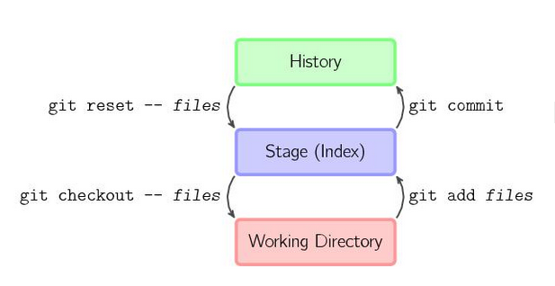

- HEAD 的含义及相关使用
  - [HEAD 的含义](#head)      
  - [git reset 使用](#reset)     
  - [显示整个本地仓储的提交](#reflog)   
  
  

## <a id="head">HEAD 的含义</a>
在 git 中，用HEAD表示当前版本，也就是最新的提交，比如：3628164...882e1e0，上一个版本就是HEAD^，上上一个版本就是HEAD^^，当然往上100个版本写100个^比较容易数不过来，所以写成HEAD~100。

 * HEAD指向的版本就是当前版本，因此，Git允许我们在版本的历史之间穿梭，使用命令 `git reset --hard commit_id`。
 * 穿梭前，用git log可以查看提交历史，以便确定要回退到哪个版本。
 * 要重返未来，用git reflog查看命令历史，以便确定要回到未来的哪个版本。

## <a id="reset">git reset 使用</a>
命令格式：

    git reset [ –-soft | –-mixed | –-hard] <commit>
git reset <commit> 的意思就是 把HEAD移到 `<commit>`。
  
    
图一: git 文件流向示意图

其中：      
* --soft：   修改版本库，保留暂存区，保留工作区。
* --mixed：  修改版本库，修改暂存区，保留工作区。（默认参数）
* --hard：   修改版本库，修改暂存区，修改工作区。

### <a id="reflog">显示整个本地仓储的提交<a/>
git reflog 显示整个本地仓储的提交
显示整个本地仓储的commit, 包括所有branch的commit, 甚至包括已经撤销的commit, 只要HEAD发生了变化, 就会在reflog里面看得到. git log只包括当前分支的commit。
例如：

    $ git reflog
    b7057a9 HEAD@{0}: reset: moving to b7057a9
    98abc5a HEAD@{1}: commit: more stuff added to foo
    b7057a9 HEAD@{2}: commit (initial): initial commit

所以，我们要找回我们第二commit，只需要做如下操作：
    
    $ git reset --hard 98abc5a

再来看一下 git 记录：

    $ git log
    * 98abc5a (HEAD, master) more stuff added to foo
    * b7057a9 initial commit

所以，如果你因为reset等操作丢失一个提交的时候，你总是可以把它找回来。除非你的操作已经被git当做垃圾处理掉了，一般是30天以后。

## 参考资料
* [git reset详解](https://segmentfault.com/a/1190000009658888)    
* [git reset --hard --soft 与 git revert 的作用](https://www.jianshu.com/p/952d83fc5bc8)    

